# Projet Réseau d’Entreprise - Cisco Packet Tracer

## Description
Ce projet présente la conception et la configuration d’une infrastructure réseau d’entreprise avec plusieurs VLANs, routage inter-VLAN, DHCP centralisé, DNS, serveur Web HTTP, VoIP, ACL et connexion Internet via ISP.

## VLANs utilisés
- VLAN 10 : IT
- VLAN 20 : RH
- VLAN 30 : Finance
- VLAN 40 : Commercial
- VLAN 50 : VoIP
- VLAN 60 : Serveurs

## Technologies utilisées
- VLAN
- Inter-VLAN Routing
- VTP
- DHCP centralisé
- DNS
- Serveur Web HTTP
- VoIP Cisco
- ACL
- Connexion Internet via ISP
- Tests de connectivité

## Services configurés
### DHCP
Le serveur DHCP distribue automatiquement les adresses IP pour chaque VLAN.

### DNS
Le DNS permet de résoudre le nom :
www.entreprise.local → 192.168.60.2

### HTTP
Un serveur Web est configuré avec une page d’accueil de l’entreprise.

### VoIP
La téléphonie IP Cisco est configurée avec des téléphones IP et des extensions internes.

### ACL
Des règles ACL sont utilisées pour contrôler l’accès entre les départements et les serveurs.

## Vérifications
- Attribution DHCP réussie
- Ping DNS réussi
- Accès au serveur Web réussi
- Test VoIP réussi
- Connexion ISP testée

## Outils utilisés
- Cisco Packet Tracer
- Cisco IOS
- VLAN, VTP, DHCP, DNS, HTTP, ACL, VoIP

## Captures d’écran

### Architecture

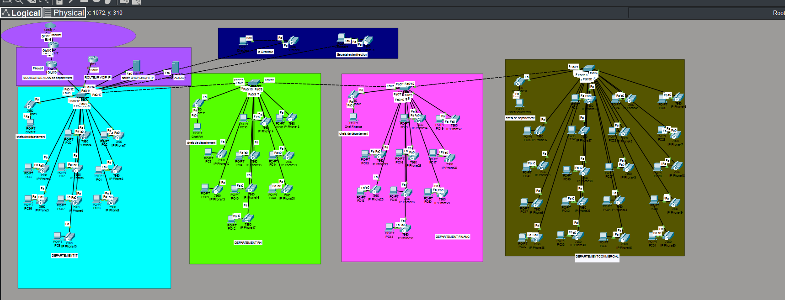

### Création des VLANs
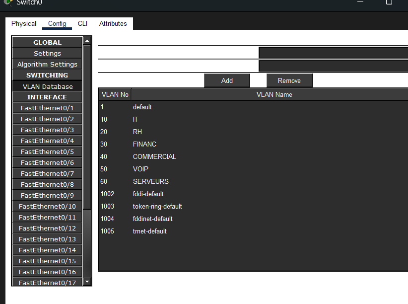

### Configuration DHCP
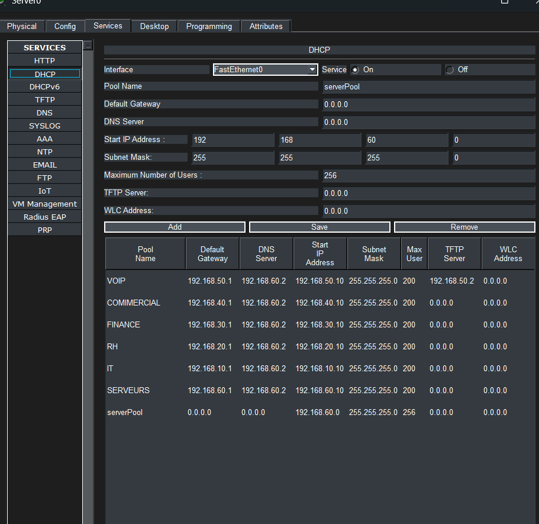

### Configuration DNS
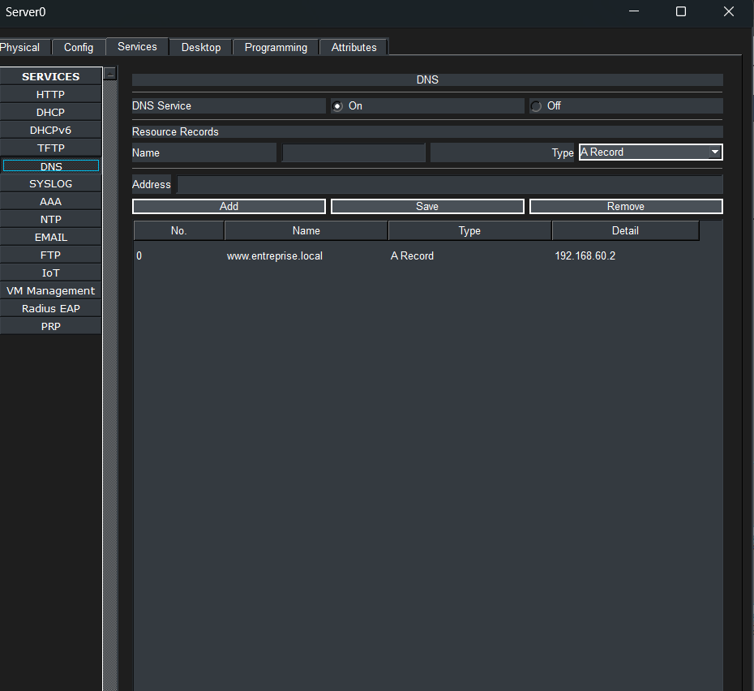

### Configuration HTTP
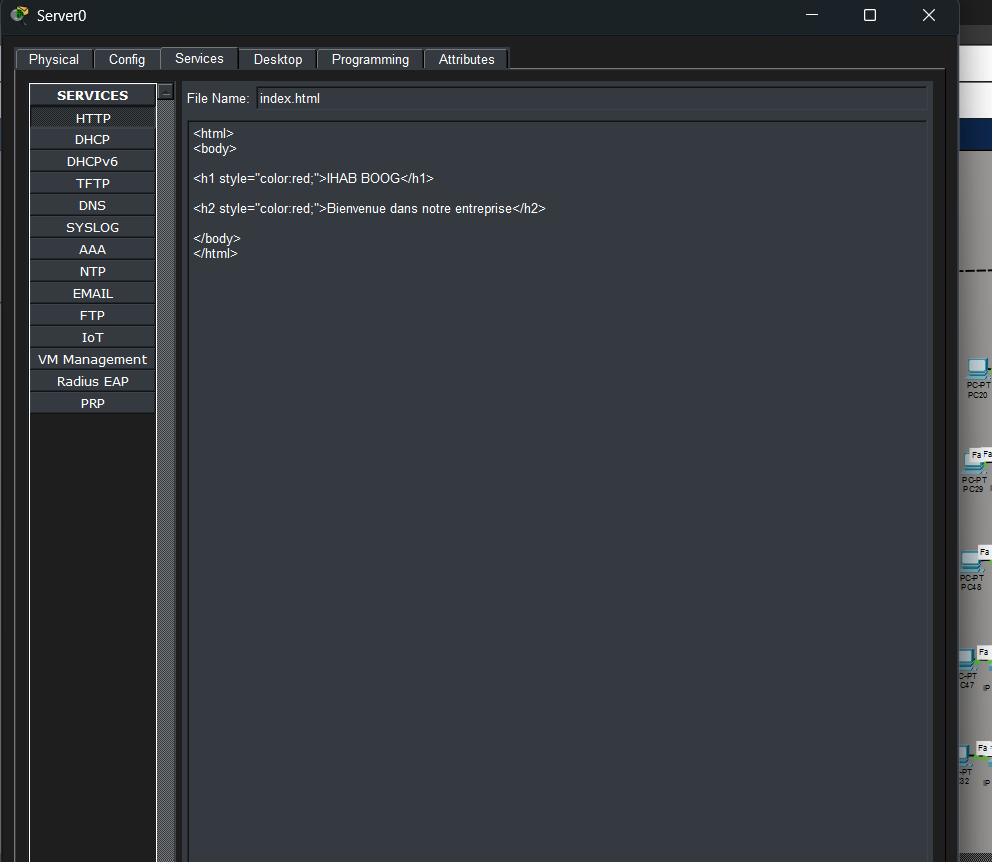

### Configuration VoIP
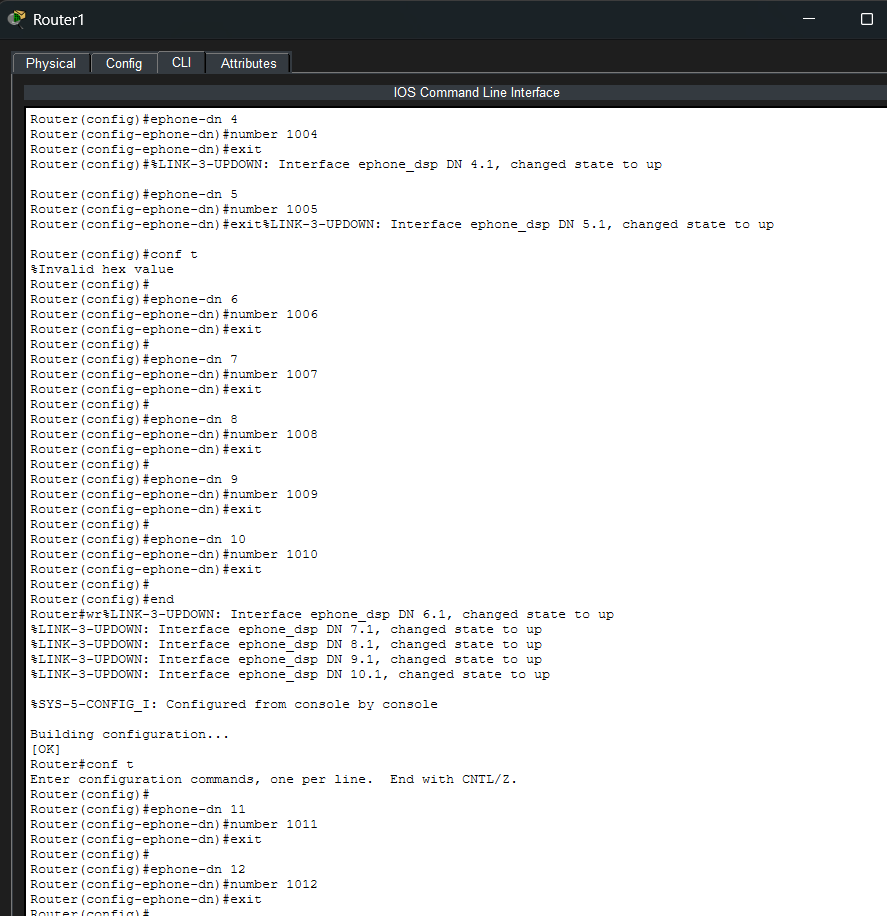

### Configuration ACL
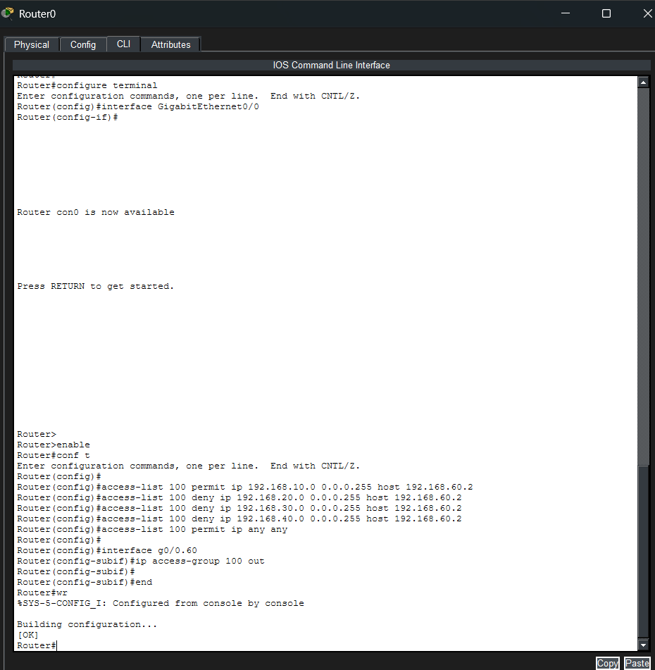

### Vérification DHCP
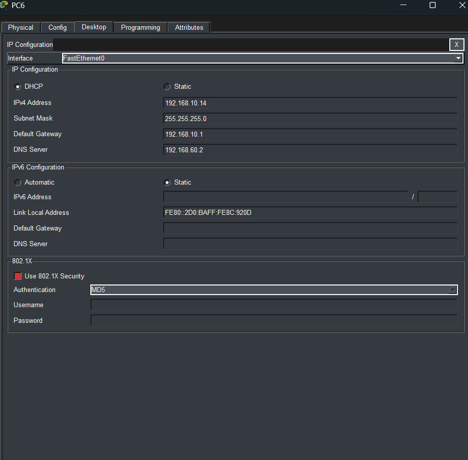

### Vérification DNS
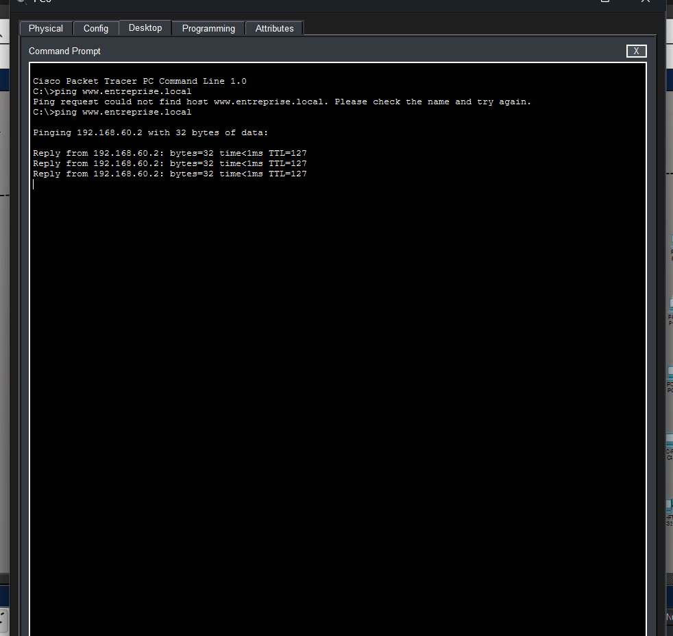

### Vérification HTTP
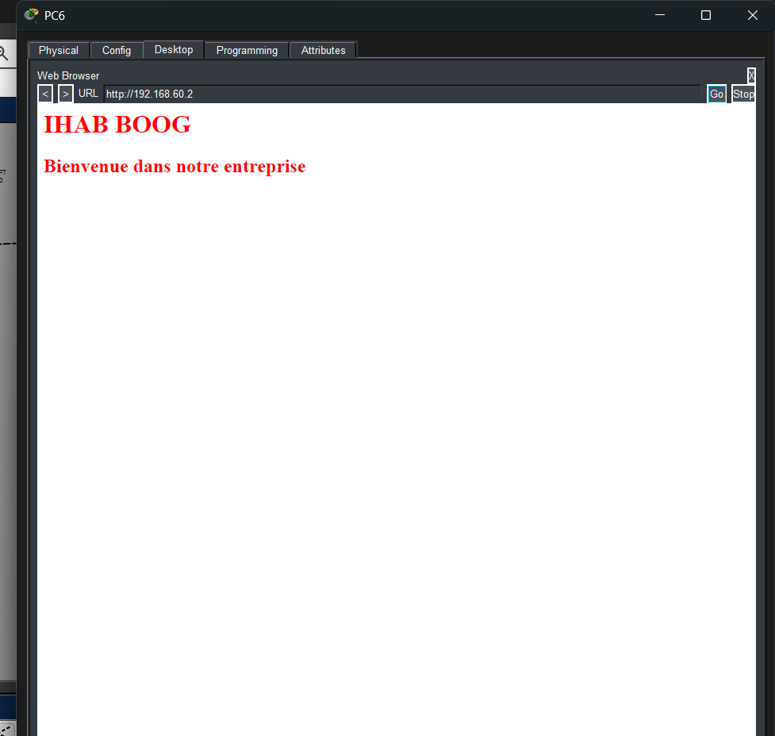

### Vérification VoIP
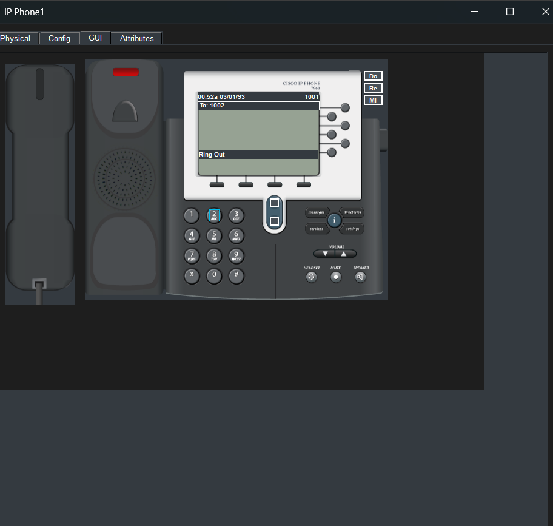

## Comment ouvrir le projet
1. Télécharger le fichier `.pkt`
2. Ouvrir Cisco Packet Tracer
3. Importer le fichier du projet
4. Tester les services : DHCP, DNS, HTTP, VoIP et ping
